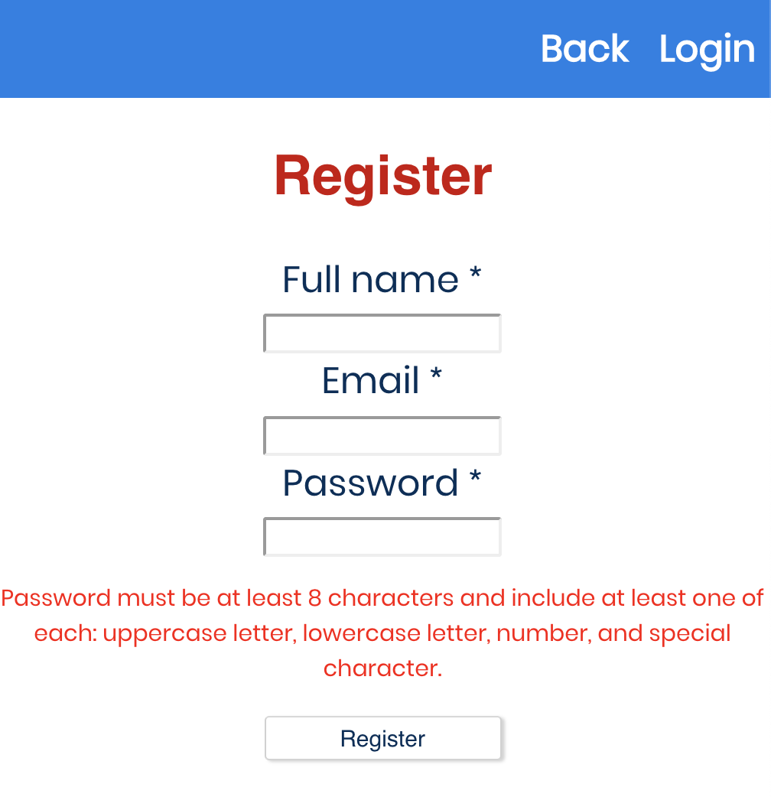
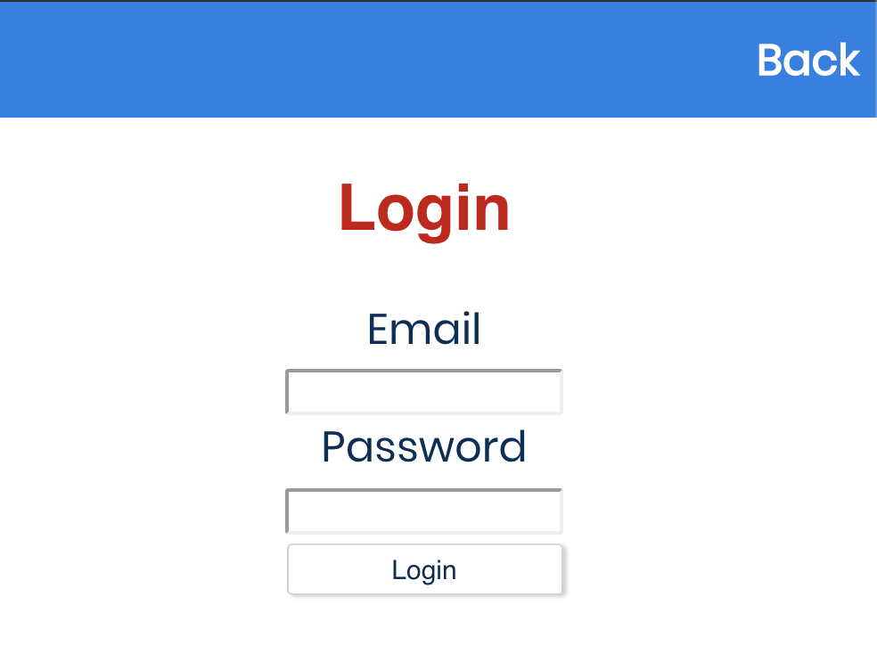
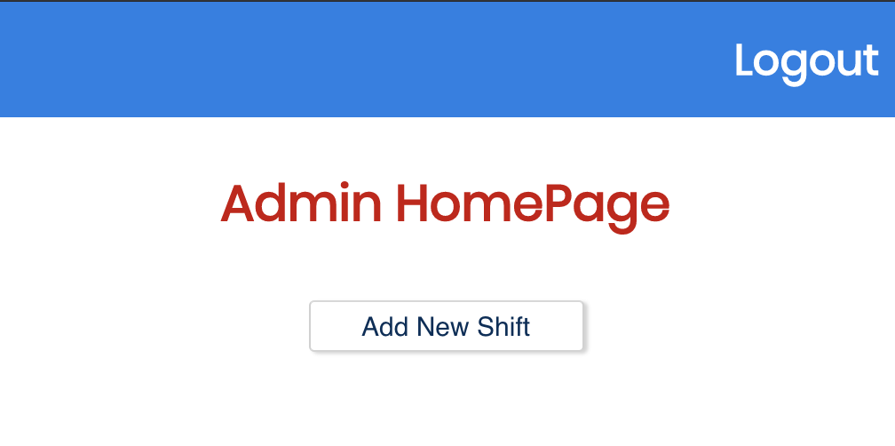
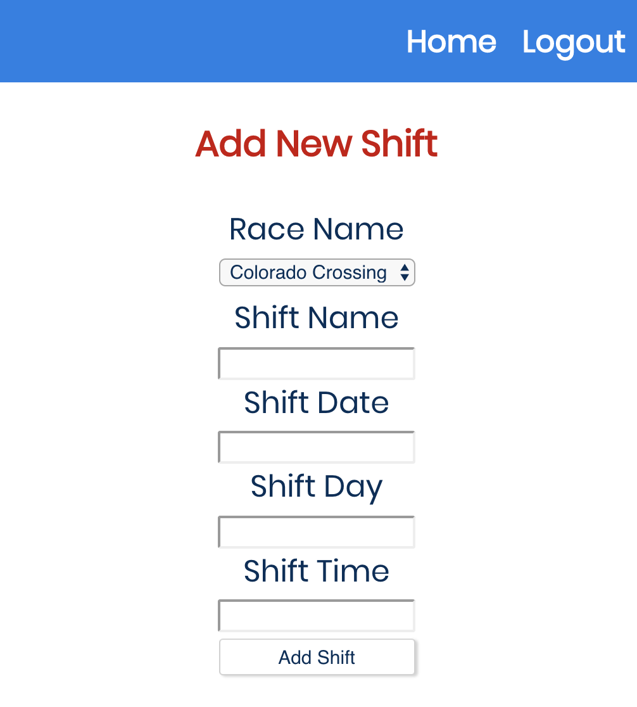
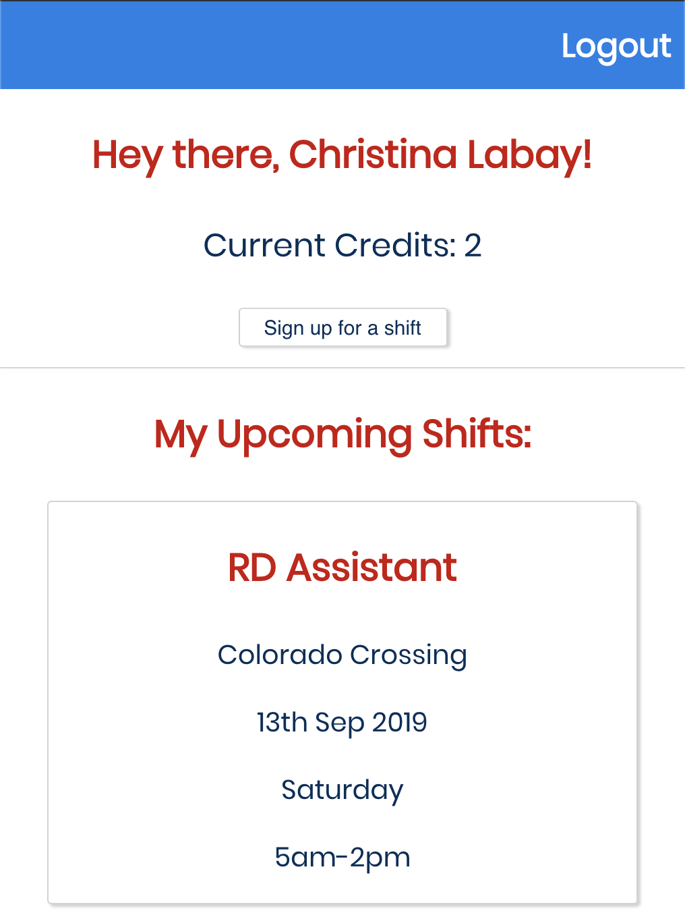
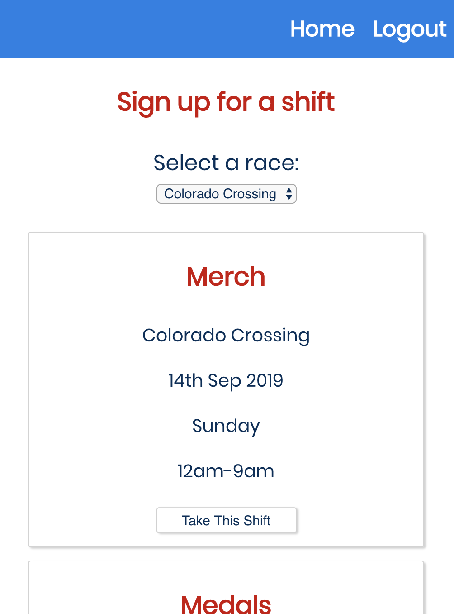

# Volunteer Portal 

## Live Link 
- [Volunteer Portal App](https://christinas-volunteer-portal.now.sh/)

## Summary
The user can create an account, and sign up for race volunteer shifts. When the user signs up for a shift, their volunteer credits increase by 1. Once signed up, on the user homepage, the shifts will display so that there will be no question in what shifts they are assigned. 
As an admin, shifts can be created for the users to sign up for.

##Screenshots: 

An admin account has been set up in order to view the admin side of the app. 
Username: email@web.com
Password: P@ssword1

### Registration Page:

New users can create an account with their name, email and password.
Admins will have to be added in to the database manually via postgres.

### Login Page:

Returning users login with their email and password.

### Admin Homepage:

Once logged in, the admin can select to create a new shift.
Future versions will allow the admins to see a list of requests from the users for Race Credits.

### Add Shifts Page:

When adding a shift, each field is required in order to be submitted.

### User Homepage:

On the homepage, users will be greated and can view their accumulated points and currently assigned shifts.

### Select Shifts:

To select a new shift, the user will come to the Add Shifts page. Upon selecting, they will be taken back to their homepage.

## Technologies Used
* JavaScript
* React 
* Node
* Express
* Postgres

## Available Scripts

In the project directory, you can run:

### `npm start`

Runs the app in the development mode. 
Open [http://localhost:3000](http://localhost:3000) to view it in the browser.

The page will reload if you make edits. 
You will also see any lint errors in the console.

### `npm test`

Launches the test runner in the interactive watch mode. 
See the section about [running tests](https://facebook.github.io/create-react-app/docs/running-tests) for more information.

### `npm run build`

Builds the app for production to the `build` folder. 
It correctly bundles React in production mode and optimizes the build for the best performance.

The build is minified and the filenames include the hashes. 
Your app is ready to be deployed!

See the section about [deployment](https://facebook.github.io/create-react-app/docs/deployment) for more information.

### `npm run eject`

**Note: this is a one-way operation. Once you `eject`, you can’t go back!**

If you aren’t satisfied with the build tool and configuration choices, you can `eject` at any time. This command will remove the single build dependency from your project.

Instead, it will copy all the configuration files and the transitive dependencies (Webpack, Babel, ESLint, etc) right into your project so you have full control over them. All of the commands except `eject` will still work, but they will point to the copied scripts so you can tweak them. At this point you’re on your own.

You don’t have to ever use `eject`. The curated feature set is suitable for small and middle deployments, and you shouldn’t feel obligated to use this feature. However we understand that this tool wouldn’t be useful if you couldn’t customize it when you are ready for it.

## Learn More

You can learn more in the [Create React App documentation](https://facebook.github.io/create-react-app/docs/getting-started).

To learn React, check out the [React documentation](https://reactjs.org/).

### Code Splitting

This section has moved here: https://facebook.github.io/create-react-app/docs/code-splitting

### Analyzing the Bundle Size

This section has moved here: https://facebook.github.io/create-react-app/docs/analyzing-the-bundle-size

### Making a Progressive Web App

This section has moved here: https://facebook.github.io/create-react-app/docs/making-a-progressive-web-app

### Advanced Configuration

This section has moved here: https://facebook.github.io/create-react-app/docs/advanced-configuration

### Deployment

This section has moved here: https://facebook.github.io/create-react-app/docs/deployment

### `npm run build` fails to minify

This section has moved here: https://facebook.github.io/create-react-app/docs/troubleshooting#npm-run-build-fails-to-minify
